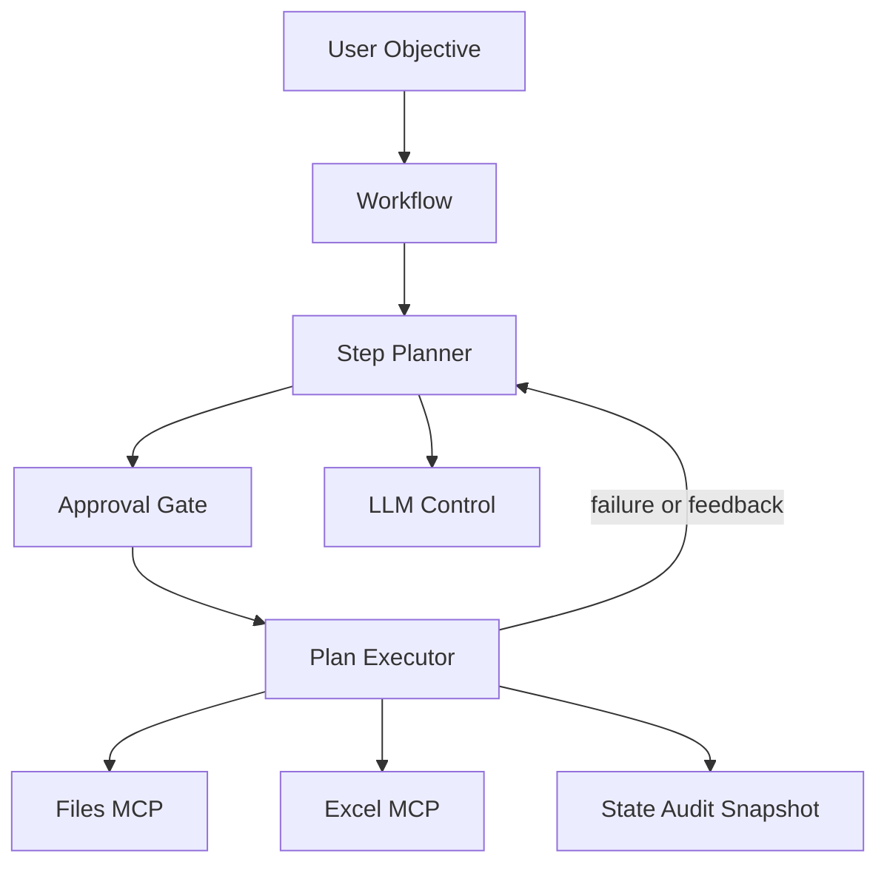

# orchestra-agent

`orchestra-agent` は、自然言語の依頼を `workflow` と `step plan` に変換し、MCP ツールを承認・監査・復旧つきで実行する orchestration product です。

Excel 自動化は同梱 capability の 1 つです。実体は Excel 専用ツールではなく、`files` / `excel` のような role を束ねて安全に実行する control plane です。

- 自然言語の objective から workflow を生成
- 実行可能な step plan を構築して approval gate を適用
- MCP runtime に実作業を委譲
- audit log、snapshot、feedback-driven replan を保持
- CLI と HTTP API の両方で運用

## Why This Exists

AI にそのまま作業を任せると、何を実行するのか、いつ人が止めるのか、失敗時にどう戻すのかが曖昧になりがちです。

`orchestra-agent` はそこを分離します。

- AI は objective を理解し、plan を作り、必要に応じて tool を選ぶ
- MCP は file / Excel などの deterministic execution を担当する
- runtime は approval、state、audit、snapshot、failure recovery を担当する

## What You Get

- `Control Plane API`
  - workflow 作成、step plan 生成、run 実行、承認、監査参照
- `CLI`
  - 単発指示からそのまま workflow を生成して実行
- `Split MCP Runtime`
  - `files` と `excel` を独立コンテナで提供
- `Workspace Contract`
  - 入出力、監査、状態、スナップショットを `workspace` に集約

## Product Guarantees

- approval gate を plan と high-risk step に適用
- run state / audit log を永続化
- 全 step 実行前 snapshot と failure 時 restore
- feedback による workflow / step plan の再生成
- `/health` `/ready` `/system` で運用状態を可視化
- 複数 MCP endpoint を 1 つの control plane に集約

## Architecture



## Bundled Capabilities

- `files`
  - workspace の一覧、検索、grep、読込、書込、コピー
- `excel`
  - `.xlsx` の読込、セル参照、grep、集計、sheet 作成、書込、画像抽出、保存

将来的に browser / database / SaaS / shell などを同じ方式で追加できます。runtime は `[[mcp.servers]]` に定義した複数 endpoint を束ねて扱います。

## Quickstart

### 1. `.env` を作る

```powershell
Copy-Item .env.example .env
```

最低限:

- 標準設定のまま起動するなら `GEMINI_API_KEY`
- OpenAI を使うなら `orchestra-agent.toml` で `llm.provider = "openai"` に変更し、`OPENAI_API_KEY` を設定

よく触る値:

- `ORCHESTRA_PUBLISH_HOST`
- `ORCHESTRA_API_PORT`
- `ORCHESTRA_MCP_FILES_PORT`
- `ORCHESTRA_MCP_EXCEL_PORT`
- `ORCHESTRA_MCP_LOG_LEVEL`

### 2. workspace を作る

```powershell
New-Item -ItemType Directory -Force workspace | Out-Null
New-Item -ItemType Directory -Force workspace/input, workspace/output | Out-Null
```

### 3. 起動する

```powershell
docker compose up --build -d
```

### 4. 運用状態を確認する

デフォルトでは localhost にだけ公開します。

- `http://127.0.0.1:8010/health`
- `http://127.0.0.1:8020/health`
- `http://127.0.0.1:9000/health`
- `http://127.0.0.1:9000/ready`
- `http://127.0.0.1:9000/system`
- `http://127.0.0.1:9000/tools`

### 5. まずは CLI で 1 本流す

```powershell
docker compose run --rm orchestra-cli "output/HelloWorld.xlsx を作成し、Sheet1 の A1 に HelloWorld と書き込んで保存して"
```

`runtime.auto_approve = false` かつ `runtime.interactive_approval = true` の場合、CLI は `yes/no/feedback` で承認を受けます。

期待結果:

- `workspace/output/HelloWorld.xlsx` が作成される
- `Sheet1!A1 = HelloWorld`

## HTTP API Flow

外部システムから組み込む場合は API を使います。

1. `POST /workflows`
2. `POST /workflows/{workflow_id}/plans`
3. `POST /runs`
4. `POST /runs/{run_id}/approval`
5. `GET /runs/{run_id}`
6. `GET /runs/{run_id}/audit?limit=50`

workflow 作成:

```powershell
curl -X POST http://127.0.0.1:9000/workflows `
  -H "Content-Type: application/json" `
  -d '{"name":"HelloWorld Excel","objective":"output/HelloWorld.xlsx を作成し、Sheet1 の A1 に HelloWorld と書き込んで保存して"}'
```

step plan 生成:

```powershell
curl -X POST http://127.0.0.1:9000/workflows/<workflow_id>/plans `
  -H "Content-Type: application/json" `
  -d "{}"
```

run 開始:

```powershell
curl -X POST http://127.0.0.1:9000/runs `
  -H "Content-Type: application/json" `
  -d '{"workflow_id":"<workflow_id>","step_plan_id":"<step_plan_id>","run_id":"run-hello","approved":false}'
```

承認:

```powershell
curl -X POST http://127.0.0.1:9000/runs/run-hello/approval `
  -H "Content-Type: application/json" `
  -d '{"approve":"yes"}'
```

修正したい場合は `feedback` を送ると workflow / step plan が再生成されます。

```powershell
curl -X POST http://127.0.0.1:9000/runs/run-hello/approval `
  -H "Content-Type: application/json" `
  -d '{"feedback":"save_file の output を output/HelloWorld.xlsx に修正して"}'
```

## Operating Model

`orchestra-agent` は 3 つの単位で見ると分かりやすいです。

- `Workflow`
  - 目的、制約、成功条件を持つ要求定義
- `Step Plan`
  - 実行順序、依存、承認要否を持つ実行計画
- `Run`
  - 現在の進行状態、承認状態、失敗情報、実行履歴

失敗や feedback が入ると version が進み、履歴が `workspace` に残ります。

## Workspace Contract

このリポジトリは `workspace` を実行用ディレクトリとして使う前提です。

- 入力: `workspace/input/...`
- 出力: `workspace/output/...`
- workflow: `workspace/workflow/...`
- plan: `workspace/plan/...`
- run state: `workspace/.orchestra_state/runs/...`
- audit: `workspace/.orchestra_state/audit/...`
- snapshots: `workspace/.orchestra_snapshots/...`

CLI/API に渡すパスは `workspace` ルート相対で扱います。

- 例: `input/sales.xlsx`
- 例: `output/summary.xlsx`

## Configuration

設定は `orchestra-agent.toml` に集約しています。

重要項目:

- `workspace`
  - artifact 保存先の基準
- `mcp.servers`
  - runtime が束ねる MCP endpoint 一覧
- `llm.provider`
  - `none` / `openai` / `google`
- `llm.planner_mode`
  - `deterministic` / `augmented` / `full`
- `runtime.auto_approve`
  - 自動承認するか
- `runtime.interactive_approval`
  - CLI で対話承認するか
- `runtime.repair_max_attempts`
  - failure / feedback 駆動の再計画上限

モードの使い分け:

- `llm.provider = none`
  - 決定論 planner を使う安全プロファイル
- `llm.provider = openai | google` と `planner_mode = full`
  - AI が tool catalog を見て plan と step 実行を制御する汎用モード
- `planner_mode = augmented`
  - 決定論 draft に対して安全な patch だけ許可する中間モード

社内 TLS が必要な場合:

```toml
[llm]
tls_verify = true
tls_ca_bundle = "./certs/company.crt"
```

## Operations

運用時はまず次を見ます。

1. `GET /ready`
2. `GET /system`
3. `workspace/.orchestra_state/runs/<run_id>.json`
4. `workspace/.orchestra_state/audit/events.ndjson`

より詳しい手順:

- [docs/operations.md](docs/operations.md)
- [docs/workspace-artifacts.md](docs/workspace-artifacts.md)

## Repository Guide

- プロダクト状態: [docs/current-status.md](docs/current-status.md)
- Docker 分離構成: [docker/README.md](docker/README.md)
- workspace artifact の見方: [docs/workspace-artifacts.md](docs/workspace-artifacts.md)

## Development

テスト:

```powershell
$env:UV_CACHE_DIR=".uv-cache"
$env:UV_PYTHON_INSTALL_DIR=".uv-python"
$env:UV_PROJECT_ENVIRONMENT=".venv-uv"
uv run --python 3.13 --extra mcp-server pytest -q tests -o cache_dir=.pytest_cache_local
```

Lint:

```powershell
$env:UV_CACHE_DIR=".uv-cache"
$env:UV_PYTHON_INSTALL_DIR=".uv-python"
$env:UV_PROJECT_ENVIRONMENT=".venv-uv"
uv run --python 3.13 ruff check src tests
```
