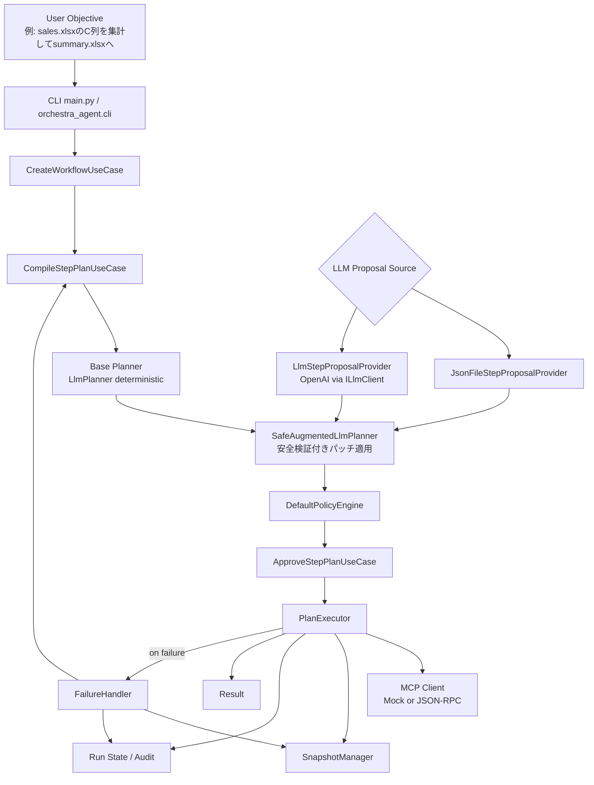

# orchestra-agent Current Status

この資料は、`orchestra-agent` の現状実装を「作業フロー」と「できること/運用上の前提」で整理したものです。

## 1. End-to-End 作業フロー



## 2. 実行ステップフロー（1 Step）

```mermaid
flowchart TD
    S0[Select next step in DAG order]
    S1{skip/run flags}
    S2{requires approval?}
    S3{backup_scope != NONE?}
    S4[Create snapshot]
    S5[Resolve input templates<br/>{{step.result_key}}]
    S6[Call MCP tool]
    S7{success?}
    S8[Record SUCCESS]
    S9[Record FAILED]
    S10[Restore snapshot]
    S11[Feedback + Replan]
    S12[Pause waiting approval]

    S0 --> S1
    S1 -->|skip| S8
    S1 -->|run| S2
    S2 -->|yes and not approved| S12
    S2 -->|no| S3
    S3 -->|yes| S4 --> S5
    S3 -->|no| S5
    S5 --> S6 --> S7
    S7 -->|yes| S8
    S7 -->|no| S9 --> S10 --> S11
```

## 3. 現状できること

- 1コマンド実行（CLI）
  - `uv run orchestra-agent "sales.xlsxのC列を集計してsummary.xlsxへ"`
- 実 Excel `.xlsx` を扱う内蔵 HTTP JSON-RPC MCP サーバ
  - `uv run --extra mcp-server orchestra-agent-mcp --workspace . --transport http`
- HTTP control plane API
  - `POST /workflows`
  - `POST /workflows/{workflow_id}/plans`
  - `POST /runs`
  - `POST /runs/{run_id}/approval`
  - `GET /runs/{run_id}`
- 単一 TOML config での設定管理
  - `--config .\orchestra-agent.toml`
  - API key だけは環境変数
- Docker Compose 起動
  - `docker compose up --build`
- workflowをXMLとして保存/再利用
  - `--workflow-id` で既存workflow指定
  - `--workflow-xml` でXMLインポート実行
- workflow単位でplanをファイル保存
  - `plan/<workflow_id>/<step_plan_id>/...`
- run state / audit の永続化
  - `.orchestra_state/runs/<run_id>.json`
  - `.orchestra_state/audit/events.ndjson`
- Excel向け StepPlan の自動生成
- DAG順実行、依存解決、テンプレート展開
- 承認ゲート（自動承認/待機/再開）
- Snapshot-before-mutation と失敗時復旧
- 失敗時のフィードバック再計画（replan）
- 監査ログ/実行履歴管理
- LLM補完（安全制約付き）
  - `--llm-provider file`（JSONパッチ）
  - `--llm-provider openai`（OpenAIライブ提案）

## 4. LLM補完の安全設計

- ベースプランは常に決定論 (`LlmPlanner`)
- LLMは「既存ステップへのパッチ提案」だけ担当
- 許可外 `tool_ref` は拒否
- パッチ適用後も `StepPlan` ドメイン検証（DAG/依存/型）を通す
- 不正提案は自動で破棄し、ベースプランへフォールバック

## 5. 運用上の前提

- Excel 実行には `openpyxl` を含む optional extra が必要
  - `uv run --extra mcp-server ...`
- Docker 実行には Docker daemon が起動している必要がある
- 標準 planner は Excel 集計ユースケースに最適化された安全側のドラフトを生成する
- 外部 MCP サーバを使う場合は `--mcp-endpoint` で JSON-RPC 互換 endpoint を指定する

## 6. 品質状態

- `ruff`: pass
- `mypy`: pass
- `pytest`: pass
