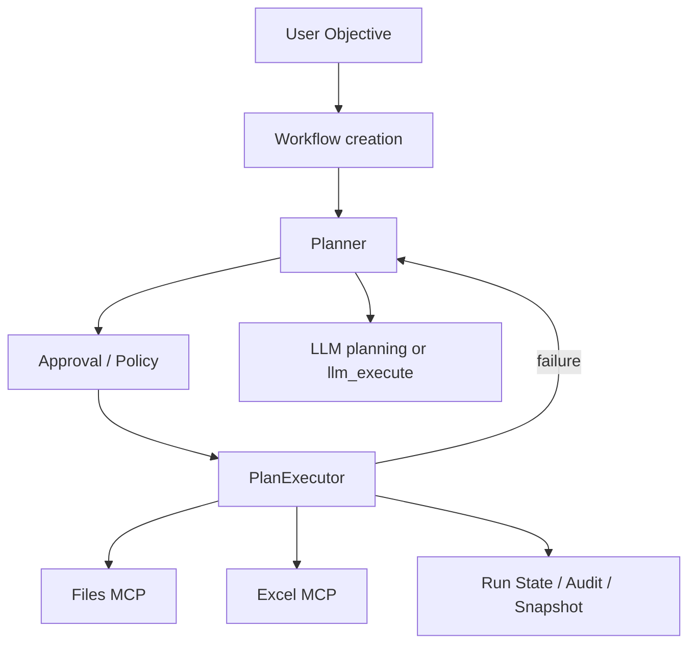

# orchestra-agent Current Status

このアプリは、Excel 専用ツールではなく、AI と MCP を使って「なんでも手順化し、安全に自動実行する」ための orchestration product です。Excel 自動化はその中の 1 つの同梱 capability です。

完全な AI 制御モードは `llm.provider = openai` または `google` のときに有効になります。`none` は決定論ベースの安全プロファイルです。

## 1. いまのプロダクト定義

- 目的:
  - 自然言語の objective から workflow を作る
  - 実行前に step plan を生成し、承認・監査・復旧を伴って実行する
  - AI が plan と各 step の実行制御を担当し、MCP runtime が実作業を実行する
- 現在の同梱 MCP role:
  - `files`: workspace の一覧、再帰検索、grep、読込、書込
  - `excel`: `.xlsx` の読込、特定セル参照、grep、画像列挙/抽出、集計、sheet 作成、保存
- 拡張方向:
  - runtime は複数 MCP endpoint を束ねられるので、将来的に browser / database / SaaS / shell などの role を横に足していける

## 2. AI と MCP の責務分離

「すべて AI 経由で実行されるか?」に対する答えは、半分 yes、半分 no です。

- AI がやること:
  - workflow objective の理解
  - available tool catalog を見た step plan 生成
  - feedback を受けた再計画
  - 各 step の解釈
  - 実行中に必要な MCP tool 選択
  - 実行中に必要なファイル添付の要求
  - `orchestra.ai_review` によるレビュー、比較、妥当性判断
- MCP がやること:
  - 実ファイル操作
  - Excel 読み書き
  - そのほか role ごとの deterministic tool execution
- core runtime がやること:
  - approval gate
  - snapshot / restore
  - audit log
  - run state 永続化
  - failure handling

つまり、AI が「何をどう進めるか」を step 単位でも決め、MCP runtime がその決定を実際の tool execution に落とします。

## 3. 現在の実行フロー

## 4. 実装済みの主要機能

- config-first
  - 1 つの `orchestra-agent.toml` で workspace / API / MCP / runtime を管理
  - API key だけ環境変数
- Docker Compose 起動
  - `docker compose up --build`
  - MCP を role ごとに分離
  - `orchestra-mcp-files`
  - `orchestra-mcp-excel`
  - `orchestra-api`
- runtime 側の multi-endpoint MCP 集約
  - 複数 endpoint の `tools/list` を統合
  - tool description も AI に渡す
  - tool 名に応じて正しい MCP server へ routing
- workflow / step plan / run state / audit 永続化
  - `workflow/`
  - `plan/`
  - `.orchestra_state/runs/`
  - `.orchestra_state/audit/`
- human-in-the-loop
  - approval-gated plan のときだけ plan 承認
  - high risk または `requires_approval=true` step だけ pre/post 承認
  - feedback による replan
  - replan 時は source workflow document と source step-plan document と修正要約を AI に渡す
- safe execution
  - 全 step 実行前 snapshot
  - failure 時 restore
  - 再計画上限
- LLM attachment support
  - message に複数ファイル添付可能
  - `orchestra.llm_execute` 中に LLM が追加ファイルを要求可能

## 5. planner の現状

- `StepPlan` 自体はまだ静的 DAG
  - first-class な `if` / `for` 構文は未導入
  - 承認、resume、snapshot、監査の整合性を壊さないため、現時点では runtime loop を plan
    schema に直接持たせていない
  - 分岐や反復が必要な探索型作業は `orchestra.llm_execute` か `orchestra.ai_review` の中で
    AI が MCP tool を反復呼び出しして処理する
- `llm.provider = none`
  - 決定論 planner を使う
  - 現状この draft planner は Excel 寄り
- `llm.provider = openai | google` かつ `planner_mode = full`
  - LLM が available MCP tools を見て full plan を構築
  - step 実行時も LLM が tool catalog を見て MCP runtime をオーケストレーション
  - Excel 以外の role を増やしたときも、このモードが汎用 orchestration の中心になる
  - judgement-heavy な step には `orchestra.ai_review` を使える
  - failure / feedback による再計画時も `replan_context` を受けて AI が再設計する
- `planner_mode = augmented`
  - 決定論 draft に対して安全な patch だけ許可
  - このモードでも AI proposal には `replan_context` が渡る

## 6. Docker / MCP 構成

現在の compose 構成は role 分離です。

- `orchestra-mcp-files`
  - `fs_list_entries`
  - `fs_find_entries`
  - `fs_grep_text`
  - `fs_read_text`
  - `fs_write_text`
- `orchestra-mcp-excel`
  - `excel.open_file`
  - `excel.read_sheet`
  - `excel.read_cells`
  - `excel.grep_cells`
  - `excel.calculate_sum`
  - `excel.create_sheet`
  - `excel.write_cells`
  - `excel.list_images`
  - `excel.extract_image`
  - `excel.save_file`
- `orchestra-api`
  - 上記 MCP 群をまとめて 1 つの control plane として扱う

この分割により、今後 role 単位で Docker service を追加しても orchestration core はそのまま使えます。

新しい MCP server を足すときは、`orchestra-agent.toml` に `[[mcp.servers]]` を追加するだけで runtime に束ねられます。

## 7. 品質状態

- `ruff`: pass
- `mypy`: pass
- `pytest`: split MCP 構成を含めて pass

## 8. 保守性の改善

- `Workflow` / `StepPlan` の文書化は domain serialization helper に集約
- planner / replan / repository / API 間の重複 JSON / XML 組み立てを削減
- `requires_approval` と runtime approval の挙動を一致させ、拡張時に意味がぶれないように整理
