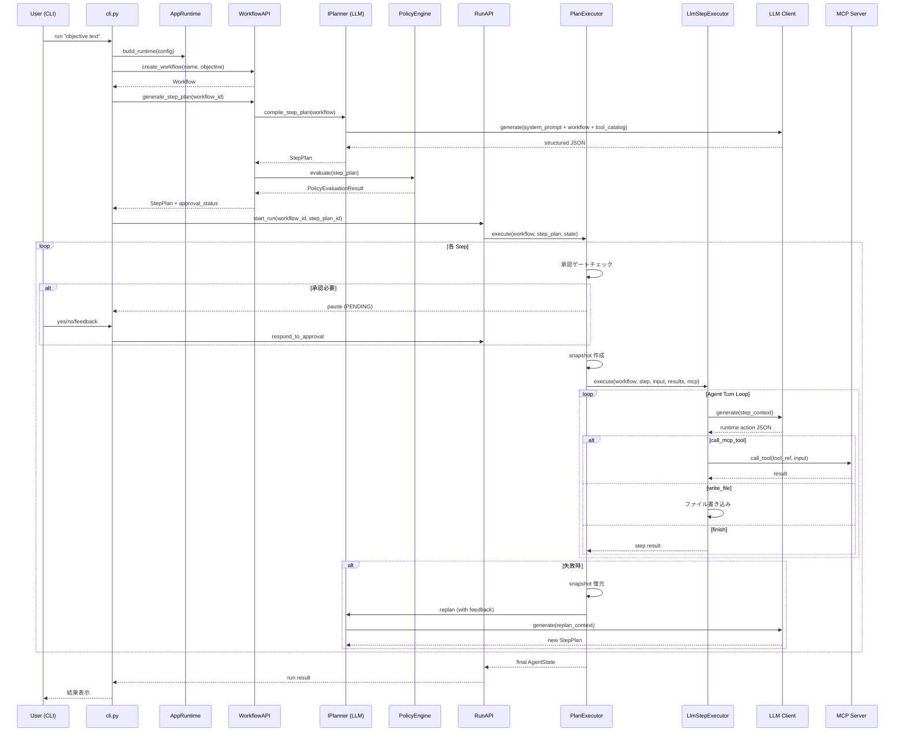

# orchestra-agent 基本設計書

> **文書バージョン**: 1.0  
> **対象コミット時点**: 2026-03-13  
> **ソースコード**: `src/orchestra_agent/`

---

## 目次

1. [プロダクト概要](#1-プロダクト概要)
2. [アーキテクチャ全体像](#2-アーキテクチャ全体像)
3. [レイヤー構成](#3-レイヤー構成)
4. [ドメインモデル](#4-ドメインモデル)
5. [ポート（インタフェース）定義](#5-ポートインタフェース定義)
6. [アダプター実装](#6-アダプター実装)
7. [ユースケース（Application 層）](#7-ユースケースapplication-層)
8. [API 層](#8-api-層)
9. [Runtime / Factory 構成](#9-runtime--factory-構成)
10. [CLI フロー](#10-cli-フロー)
11. [Control Plane（HTTP API サーバー）](#11-control-planehttp-api-サーバー)
12. [MCP サーバー](#12-mcp-サーバー)
13. [LLM プロバイダー機構](#13-llm-プロバイダー機構)
14. [Planner 機構](#14-planner-機構)
15. [実行エンジン（PlanExecutor）](#15-実行エンジンplanexecutor)
16. [障害復旧・再計画（FailureHandler）](#16-障害復旧再計画failurehandler)
17. [承認フロー（Human-in-the-Loop）](#17-承認フローhuman-in-the-loop)
18. [Step Runtime Protocol](#18-step-runtime-protocol)
19. [Observability / Audit](#19-observability--audit)
20. [設定体系](#20-設定体系)
21. [デプロイ構成](#21-デプロイ構成)
22. [データフロー全体シーケンス](#22-データフロー全体シーケンス)
23. [ディレクトリ構成マップ](#23-ディレクトリ構成マップ)
24. [用語集](#24-用語集)

---

## 1. プロダクト概要

### 1.1 目的

orchestra-agent は **自然言語の objective から Workflow を生成し、AI が StepPlan を構築・MCP runtime 経由で安全に自動実行する orchestration product** である。

- ユーザーは日本語/英語等の自然言語で目標を入力する
- AI (LLM) が利用可能な MCP ツールを参照し、実行計画（StepPlan）を自動生成する
- 各ステップは承認ゲート・スナップショット・監査ログを伴い安全に実行される
- 失敗時はスナップショット復元 + AI 再計画で自律回復を試みる

### 1.2 同梱 MCP ケイパビリティ

| ロール | 説明 | 主要ツール |
|--------|------|-----------|
| **files** | Workspace ファイル操作 | `fs_list_entries`, `fs_find_entries`, `fs_grep_text`, `fs_read_text`, `fs_write_text` |
| **excel** | Excel (.xlsx) 操作 | `excel.open_file`, `excel.read_sheet`, `excel.read_cells`, `excel.write_cells`, `excel.save_file` 他 |

### 1.3 エントリーポイント

| コマンド | モジュール | 説明 |
|----------|-----------|------|
| `orchestra-agent` | `orchestra_agent.cli:main` | CLI（`run` / `plan` / `resume` / `status`） |
| `orchestra-agent-api` | `orchestra_agent.control_plane:main` | HTTP Control Plane API サーバー |
| `orchestra-agent-mcp` | `orchestra_agent.mcp_server.__main__:main` | MCP サーバー（files / excel） |

---

## 2. アーキテクチャ全体像

```
┌─────────────────────────────────────────────────────────────────────┐
│                          User Interface                             │
│   CLI (cli.py)  │  Control Plane HTTP (control_plane.py)           │
├─────────────────┼───────────────────────────────────────────────────┤
│                          API Layer                                  │
│   WorkflowAPI   │   ApprovalAPI   │   RunAPI                       │
├─────────────────┼─────────────────┼─────────────────────────────────┤
│                     Application / Use Cases                         │
│  CreateWorkflow │ CompileStepPlan │ ApproveStepPlan │ ExecutePlan  │
│  ApplyFeedback  │ EvaluatePolicy  │ HandleFailure                  │
├─────────────────────────────────────────────────────────────────────┤
│                        Domain Model                                 │
│  Workflow │ StepPlan │ Step │ AgentState │ ExecutionRecord │ Enums  │
├─────────────────────────────────────────────────────────────────────┤
│                     Ports (Protocol/Interface)                      │
│  ILlmClient │ IMcpClient │ IPlanner │ IPolicyEngine │ IStepExecutor│
│  IAgentStateStore │ IAuditLogger │ ISnapshotManager               │
│  IWorkflowRepository │ IStepPlanRepository                         │
├─────────────────────────────────────────────────────────────────────┤
│                     Adapters (実装)                                  │
│  LLM: OpenAI / Google / ChatGPT-Playwright                        │
│  MCP: JsonRpc / MultiEndpoint / Mock                               │
│  Planner: StructuredLlm / SafeAugmented / LlmPlanner              │
│  DB: Filesystem / XML / InMemory / Postgres                        │
│  Execution: LlmStepExecutor                                        │
│  Policy: DefaultPolicyEngine                                        │
│  Snapshot: FilesystemSnapshotManager                                │
├─────────────────────────────────────────────────────────────────────┤
│                   Infrastructure / External                         │
│  MCP Server (files/excel)  │  Chrome/Playwright  │  OpenAI/Google  │
└─────────────────────────────────────────────────────────────────────┘
```

---

## 3. レイヤー構成

本システムは **Hexagonal Architecture (Ports & Adapters)** を採用している。

| レイヤー | パッケージ | 責務 |
|----------|-----------|------|
| **Domain** | `domain/` | ビジネスエンティティ・値オブジェクト・ドメインルール |
| **Ports** | `ports/` | 外部依存への Protocol（インタフェース）定義 |
| **Application** | `application/use_cases/` | ユースケース（ドメイン操作の組立て） |
| **Adapters** | `adapters/` | Port の具象実装（LLM, MCP, DB, Policy, Snapshot） |
| **API** | `api/` | Facade / Service 層（CLI・HTTP 両方から利用） |
| **Runtime** | `runtime_support/` | DI コンテナ相当。Factory でランタイム全体を組立て |
| **CLI** | `cli.py` | コマンドライン UI |
| **Control Plane** | `control_plane.py` | HTTP API サーバー UI |
| **MCP Server** | `mcp_server/` | ファイル・Excel ツールの MCP 公開 |
| **Shared** | `shared/` | 横断ユーティリティ（JSON 抽出, プロンプト構築, エラー処理等） |
| **Observability** | `observability.py` | コンテキスト変数による横断ログ、Logging デコレータ |

---

## 4. ドメインモデル

### 4.1 Workflow

```
domain/workflow.py
```

| フィールド | 型 | 説明 |
|-----------|---|------|
| `workflow_id` | `str` | 一意識別子（例: `wf-0229e2ff64`） |
| `name` | `str` | 表示名 |
| `version` | `int` | バージョン（feedback 時にインクリメント） |
| `objective` | `str` | 自然言語の目標テキスト |
| `reference_files` | `list[str]` | 参照ファイルパス一覧 |
| `constraints` | `list[str]` | 制約条件 |
| `success_criteria` | `list[str]` | 成功基準 |
| `feedback_history` | `list[str]` | これまでのフィードバック履歴 |
| `replan_context` | `ReplanContext?` | 再計画時のコンテキスト |

**`with_feedback()`** メソッドで immutable にバージョンアップした新 Workflow を生成する。

### 4.2 StepPlan

```
domain/step_plan.py
```

| フィールド | 型 | 説明 |
|-----------|---|------|
| `step_plan_id` | `str` | 一意識別子 |
| `workflow_id` | `str` | 親 Workflow への参照 |
| `version` | `int` | バージョン |
| `steps` | `list[Step]` | 実行ステップ一覧 |

- 内部で **DAG のトポロジカルソート** を行い、循環依存を検出する
- `ordered_steps()` で実行順を返す
- `requires_runtime_approval` プロパティで承認要否を判定

### 4.3 Step

```
domain/step.py
```

| フィールド | 型 | 説明 |
|-----------|---|------|
| `step_id` | `str` | ステップ ID |
| `name` | `str` | 表示名 |
| `description` | `str` | 説明文 |
| `tool_ref` | `str` | MCP ツール参照名（例: `excel.write_cells`） |
| `resolved_input` | `dict` | ツールへの入力パラメータ |
| `depends_on` | `list[str]` | 依存先 step_id のリスト |
| `risk_level` | `RiskLevel` | `LOW` / `MEDIUM` / `HIGH` / `CRITICAL` |
| `requires_approval` | `bool` | 明示的承認要求フラグ |
| `run` | `bool` | 実行対象か |
| `skip` | `bool` | スキップ対象か |
| `backup_scope` | `BackupScope` | スナップショット範囲 |

**`requires_runtime_approval`** プロパティ: `requires_approval=True` もしくは `risk_level` が `HIGH`/`CRITICAL` の場合に `True`。

### 4.4 AgentState

```
domain/agent_state.py
```

実行中の Run の状態を保持する。

| フィールド | 型 | 説明 |
|-----------|---|------|
| `run_id` | `str` | ラン ID（UUID ベース） |
| `workflow_id` | `str?` | 実行中 Workflow |
| `step_plan_id` | `str?` | 実行中 StepPlan |
| `current_step_id` | `str?` | 現在のステップ |
| `approval_status` | `ApprovalStatus` | `PENDING` / `APPROVED` / `REJECTED` / `NOT_REQUIRED` |
| `execution_history` | `list[ExecutionRecord]` | 実行履歴 |
| `snapshot_refs` | `list[str]` | スナップショット参照一覧 |
| `last_error` | `str?` | 最新エラー |
| `metadata` | `dict` | 拡張メタデータ（承認コンテキスト等） |

### 4.5 ExecutionRecord

```
domain/execution_record.py
```

各ステップの実行記録。状態遷移: `PENDING → RUNNING → SUCCESS / FAILED / SKIPPED`

### 4.6 Enums

```
domain/enums.py
```

| 列挙型 | 値 |
|--------|---|
| `RiskLevel` | `LOW`, `MEDIUM`, `HIGH`, `CRITICAL` |
| `ApprovalStatus` | `NOT_REQUIRED`, `PENDING`, `APPROVED`, `REJECTED` |
| `ExecutionStatus` | `PENDING`, `RUNNING`, `SUCCESS`, `FAILED`, `SKIPPED` |
| `BackupScope` | `NONE`, `FILE`, `WORKSPACE`, `FULL` |

---

## 5. ポート（インタフェース）定義

すべて `typing.Protocol` で定義されており、実装への依存を持たない。

| ポート | ファイル | メソッド | 説明 |
|--------|---------|---------|------|
| **ILlmClient** | `ports/llm_client.py` | `generate(LlmGenerateRequest) → str` | LLM へのテキスト生成要求 |
| **IMcpClient** | `ports/mcp_client.py` | `list_tools() → list[str]`<br>`call_tool(tool_ref, input) → dict` | MCP ツール呼び出し |
| **IPlanner** | `ports/planner.py` | `compile_step_plan(Workflow) → StepPlan` | Workflow → StepPlan 変換 |
| **IPolicyEngine** | `ports/policy_engine.py` | `evaluate(StepPlan) → PolicyEvaluationResult` | リスク評価・承認要否判定 |
| **IStepExecutor** | `ports/step_executor.py` | `execute(Workflow, Step, input, results, mcp) → dict` | 単一ステップの実行 |
| **IAgentStateStore** | `ports/agent_state_store.py` | `load(run_id)` / `save(state)` / `append_execution(...)` | ラン状態の永続化 |
| **IAuditLogger** | `ports/audit_logger.py` | `record(event)` | 監査イベント記録 |
| **ISnapshotManager** | `ports/snapshot_manager.py` | `create_snapshot(scope, metadata)` / `restore_snapshot(ref)` | ファイル復元用スナップショット |
| **IWorkflowRepository** | `ports/workflow_repository.py` | `save(workflow)` / `get(workflow_id, version?)` | Workflow 永続化 |
| **IStepPlanRepository** | `ports/step_plan_repository.py` | `save(step_plan)` / `get(step_plan_id, version?)` | StepPlan 永続化 |

### 5.1 LlmGenerateRequest

```python
@dataclass
class LlmGenerateRequest:
    messages: tuple[LlmMessage, ...]       # system / user / assistant メッセージ列
    response_format: "text" | "json_object" # 応答形式指定
    temperature: float = 0.0
    max_tokens: int | None = None
```

`LlmMessage` は `role`, `content`, `attachments` を持ち、ファイル添付が可能。

---

## 6. アダプター実装

### 6.1 LLM アダプター

| クラス | ファイル | 対象 |
|--------|---------|------|
| `OpenAILlmClient` | `adapters/llm/openai_llm_client.py` | OpenAI API (GPT-4.1-mini 等) |
| `GoogleGeminiLlmClient` | `adapters/llm/google_gemini_llm_client.py` | Google Gemini API |
| `ChatGptPlaywrightLlmClient` | `adapters/llm/chatgpt_playwright_llm_client.py` | ブラウザ経由 ChatGPT |

**ChatGptPlaywrightLlmClient** は `chat_gpt_playwright` パッケージの `ChatGPTClient` を内部で利用し、CDP (Chrome DevTools Protocol) 経由で実 Chrome を操作して ChatGPT Custom GPT とやり取りする。

### 6.2 MCP クライアント

| クラス | 説明 |
|--------|------|
| `JsonRpcMcpClient` | 単一 endpoint への JSON-RPC MCP クライアント |
| `MultiEndpointMcpClient` | 複数 MCP endpoint を統合し、ツール名でルーティング |
| `MockExcelMcpClient` | テスト用モック |

### 6.3 Planner

| クラス | Planner Mode | 説明 |
|--------|-------------|------|
| `StructuredLlmPlanner` | `full` | LLM に Workflow + ツールカタログを渡し、構造化 JSON で StepPlan を生成 |
| `SafeAugmentedLlmPlanner` | `augmented` | 決定論ベース draft に LLM パッチを安全適用 |
| `LlmPlanner` | `deterministic` | LLM 不使用の決定論 Planner（Excel 寄り） |

### 6.4 永続化

| クラス | 説明 |
|--------|------|
| `XmlWorkflowRepository` | Workflow を XML で永続化 (`workflow/` 配下) |
| `FilesystemStepPlanRepository` | StepPlan を JSON で永続化 (`plan/` 配下) |
| `FilesystemAgentStateStore` | ラン状態を JSON で永続化 (`.orchestra_state/runs/`) |
| `FilesystemAuditLogger` | 監査イベントを JSON Lines で永続化 (`.orchestra_state/audit/`) |
| `FilesystemSnapshotManager` | ファイルスナップショット管理 (`.orchestra_snapshots/`) |

### 6.5 ポリシーエンジン

`DefaultPolicyEngine` は以下を行う:

1. `HIGH` / `CRITICAL` リスクのステップを検出し理由を記録
2. `requires_approval=True` のステップを検出
3. 承認要ステップがある場合、最初の実行可能ステップにも承認を付与
4. 承認要ステップが存在すれば `ApprovalStatus.PENDING`、なければ `NOT_REQUIRED` を返す

### 6.6 ステップ実行器

`LlmStepExecutor` は **AI が MCP ツールを動的に選択・実行するランタイムループ** を実装する。

1. LLM に Workflow コンテキスト + ツールカタログ + ワークスペースファイル一覧を送信
2. LLM が返す **Runtime Action** (JSON) を解釈
3. `call_mcp_tool` / `write_file` / `request_file_attachments` / `finish` を実行
4. `finish` が返るまで最大 `max_agent_turns`（デフォルト10）回ループ

---

## 7. ユースケース（Application 層）

```
application/use_cases/
```

| ユースケース | 説明 |
|-------------|------|
| **CreateWorkflowUseCase** | 自然言語 objective → Workflow 生成 + 永続化 + 監査記録 |
| **CompileStepPlanUseCase** | Workflow → Planner で StepPlan 生成 → PolicyEngine で評価 → 永続化 |
| **ApproveStepPlanUseCase** | StepPlan の承認/拒否 + ステップ単位の run/skip フラグ変更 |
| **ExecutePlanUseCase** | StepPlan を PlanExecutor で実行、AgentState を管理 |
| **ApplyFeedbackUseCase** | ユーザーフィードバックを受けて再計画をトリガー |
| **EvaluatePolicyUseCase** | PolicyEngine による単独評価 |
| **HandleFailureUseCase** | 障害復旧ロジック |

---

## 8. API 層

```
api/
```

| API クラス | 主要メソッド | 説明 |
|-----------|------------|------|
| **WorkflowAPI** | `create_workflow(...)`, `generate_step_plan(workflow_id)` | Workflow 作成 + StepPlan コンパイル |
| **ApprovalAPI** | `approve_step_plan(step_plan_id, ...)` | StepPlan 承認操作 |
| **RunAPI** | `start_run(...)`, `resume_run(...)`, `respond_to_approval(...)`, `submit_feedback(...)`, `get_run(...)` | 実行ライフサイクル管理 |

これらは CLI・Control Plane の両方から呼ばれる **Facade** として機能する。

---

## 9. Runtime / Factory 構成

### 9.1 AppRuntime

`runtime_support/models.py` の `AppRuntime` は DI コンテナに相当し、全コンポーネントへの参照を保持する。

```python
@dataclass
class AppRuntime:
    workflow_api: WorkflowAPI
    approval_api: ApprovalAPI
    run_api: RunAPI
    workflow_repo: XmlWorkflowRepository
    step_plan_repo: FilesystemStepPlanRepository
    planner: IPlanner
    mcp_client: IMcpClient
    llm_client: ILlmClient | None
    audit_logger: FilesystemAuditLogger
    artifacts: RuntimeArtifacts
    metadata: RuntimeMetadata
    using_mock: bool
```

### 9.2 Factory チェーン

`DefaultRuntimeFactory.create(config)` が以下の順で組み立てる:

```
RuntimeConfig
 ├─→ DefaultMcpClientFactory     → IMcpClient
 ├─→ DefaultLlmProviderFactory   → ILlmClient + IStepProposalProvider
 ├─→ DefaultPlannerFactory       → IPlanner
 ├─→ FilesystemAgentStateStore
 ├─→ FilesystemAuditLogger
 ├─→ XmlWorkflowRepository
 ├─→ FilesystemStepPlanRepository
 ├─→ FilesystemSnapshotManager
 ├─→ DefaultPolicyEngine
 ├─→ LlmStepExecutor
 ├─→ FailureHandler
 ├─→ PlanExecutor
 ├─→ Use Cases (Create/Compile/Approve/Execute)
 └─→ APIs (Workflow/Approval/Run)
      └─→ AppRuntime
```

各 Factory は `Protocol` インタフェースを持つため、テスト時に差し替え可能。

### 9.3 Planner Mode 解決

| `llm_provider` | `llm_planner_mode` | 解決される Mode |
|-----------------|--------------------|----|
| `none` | 未指定 | `deterministic` |
| `file` | 未指定 | `augmented` |
| `openai` / `google` / `chatgpt_playwright` | 未指定 | `full` |
| 任意 | 明示指定 | 指定値がそのまま使用 |

---

## 10. CLI フロー

### 10.1 コマンド体系

| コマンド | 説明 |
|---------|------|
| `run <objective>` | Workflow 作成 → StepPlan 生成 → 実行 → 結果表示 |
| `plan <objective>` | Workflow 作成 → StepPlan 生成のみ（実行しない） |
| `resume <run_id>` | 中断された Run を再開（承認/拒否/フィードバック） |
| `status <run_id>` | Run 状態の確認（LLM/MCP 不要） |

目的語なしでコマンド名を省略した場合は `run` にフォールバックする。

### 10.2 `run` コマンドの処理フロー

```
main(argv)
 │
 ├─ 1. resolve_config_path → load_app_config
 ├─ 2. build_parser(config) → parse_args
 ├─ 3. _build_runtime_from_args → AppRuntime 組立て
 ├─ 4. _prepare_plan
 │     ├─ _resolve_workflow_id
 │     │    ├─ (a) --workflow-xml → import_from_xml
 │     │    ├─ (b) --workflow-id → 既存取得 or 新規作成
 │     │    └─ (c) objective テキスト → create_workflow
 │     ├─ workflow_api.generate_step_plan
 │     │    ├─ planner.compile_step_plan(workflow)
 │     │    ├─ policy_engine.evaluate(plan)
 │     │    └─ step_plan_repository.save(plan)
 │     └─ _rewrite_step_plan_paths → パス正規化
 ├─ 5. _start_and_resume
 │     ├─ run_api.start_run → PlanExecutor.execute
 │     ├─ _resume_auto_approvals (auto-approve ループ)
 │     └─ _resume_interactive_approvals (対話承認ループ)
 │          ├─ yes → respond_to_approval(approve=True)
 │          ├─ no  → respond_to_approval(approve=False)
 │          └─ feedback → submit_feedback → replan → resume
 └─ 6. _print_result + _print_artifacts
```

### 10.3 終了コード

| コード | 意味 |
|--------|------|
| `0` | 正常完了 |
| `1` | 実行エラー（`last_error` あり） |
| `2` | 承認待ち (`PENDING`) |

---

## 11. Control Plane（HTTP API サーバー）

`control_plane.py` が `ThreadingHTTPServer` ベースの REST API を提供する。

- `orchestra-agent-api --config orchestra-agent.toml --workspace ./workspace` で起動
- デフォルトは `127.0.0.1:9000`
- 内部で `AppRuntime` を保持し、`WorkflowAPI` / `RunAPI` 等を HTTP 経由で公開

CLI と同じ `AppRuntime` を使用するため、ビジネスロジックは完全に共有される。

---

## 12. MCP サーバー

### 12.1 構成

```
mcp_server/
 ├─ server.py          ← create_mcp_server / run_jsonrpc_server
 ├─ file_service.py    ← WorkspaceFileService
 ├─ excel_service.py   ← ExcelWorkspaceService
 └─ jsonrpc_server.py  ← JSON-RPC HTTP ラッパー
```

### 12.2 ツールグループ

| グループ | ツール |
|---------|--------|
| `files` | `server_ping`, `fs_list_entries`, `fs_find_entries`, `fs_grep_text`, `fs_read_text`, `fs_write_text` |
| `excel` | `excel.open_file`, `excel.read_sheet`, `excel.read_cells`, `excel.grep_cells`, `excel.calculate_sum`, `excel.create_sheet`, `excel.write_cells`, `excel.list_images`, `excel.extract_image`, `excel.save_file` |
| `all` | 上記すべて |

### 12.3 起動方法

```
# files サーバー (port 8010)
orchestra-agent-mcp --config orchestra-agent.toml --workspace ./workspace --server files

# excel サーバー (port 8020)
orchestra-agent-mcp --config orchestra-agent.toml --workspace ./workspace --server excel
```

---

## 13. LLM プロバイダー機構

### 13.1 プラグインアーキテクチャ

LLM プロバイダーは **Plugin 方式** で拡張可能。

```
runtime_support/llm_provider_plugins.py
```

1. **Built-in**: `none`, `file`, `openai`, `google`（`DefaultLlmProviderFactory` に直接実装）
2. **External**: `llm.provider_modules` で指定したモジュールを動的 import

外部モジュールは以下の規約に従う:

```python
# 必須エクスポート
PROVIDER_NAME: str = "chatgpt_playwright"

def build_llm_provider(config: RuntimeConfig) -> LlmProviderBundle:
    ...
```

### 13.2 プロバイダー一覧

| Provider 名 | クラス | 特徴 |
|-------------|--------|------|
| `none` | N/A | LLM 不使用。決定論 Planner |
| `file` | `JsonFileStepProposalProvider` | JSON ファイルから StepPlan を読み込み |
| `openai` | `OpenAILlmClient` | OpenAI API。要 `OPENAI_API_KEY` |
| `google` | `GoogleGeminiLlmClient` | Google Gemini API。要 `GEMINI_API_KEY` |
| `chatgpt_playwright` | `ChatGptPlaywrightLlmClient` | ブラウザ ChatGPT。API キー不要、ログインセッション使用 |

### 13.3 ChatGPT Playwright 固有フロー

```
ChatGptPlaywrightLlmClient
 ├─ _ensure_session()
 │    ├─ ChatGPTClient(chrome_path, profile_dir, port)
 │    │    ├─ Chrome を CDP 起動保証
 │    │    ├─ Playwright が CDP 接続
 │    │    └─ ユーザーに手動ログインを要求
 │    └─ session.start_chat(custom_gpt_url)
 └─ generate(request)
      ├─ _request_to_chat_prompt: messages → 1 本のテキストに結合
      ├─ _latest_attachment_paths: 最新メッセージの添付ファイルを取得
      └─ session.chat(prompt, file_paths=[...])
           ├─ contenteditable に入力
           ├─ ファイル添付 (input[type=file])
           ├─ send-button クリック
           ├─ stop-button 出現→消滅を待機
           └─ 最後の assistant article から応答テキスト抽出
```

---

## 14. Planner 機構

### 14.1 Full Mode（StructuredLlmPlanner）

LLM に以下の情報を渡し、構造化 JSON で StepPlan を生成させる:

- Workflow 定義（objective, constraints, reference_files, feedback_history, replan_context）
- MCP ツールカタログ（名前、説明、パラメータスキーマ）
- Step runtime 種別一覧

LLM の JSON レスポンスを parse して `StepPlan` / `Step` のドメインオブジェクトに変換する。フォールバック用の `fallback_planner` も保持。

### 14.2 Augmented Mode（SafeAugmentedLlmPlanner）

1. 決定論 `LlmPlanner` でベース StepPlan を生成
2. `LlmStepProposalProvider` が LLM に改善提案を依頼
3. 安全なパッチのみ適用（破壊的変更は拒否）

### 14.3 Deterministic Mode（LlmPlanner）

LLM を使わず、Workflow の objective からルールベースで StepPlan を生成。現時点では Excel ワークフローに最適化。

---

## 15. 実行エンジン（PlanExecutor）

```
executor/plan_executor.py
```

### 15.1 メインループ

```python
def execute(workflow, step_plan, state) → AgentState:
    while True:
        status, context = _execute_single_plan(workflow, plan, state)
        if status == "completed" or "paused":
            return state
        # failure → FailureHandler で復旧判定
        decision = failure_handler.handle_failure(context, replan_attempt)
        if not decision.should_replan:
            state → REJECTED
            return state
        # 復旧成功 → 新 workflow/plan で再ループ
        apply_recovery_decision(state, decision)
```

### 15.2 単一プラン実行 (_execute_single_plan)

```
for step in step_plan.ordered_steps():
 ├─ 既処理チェック → skip
 ├─ step.skip or not step.run → SKIPPED として記録
 ├─ 承認ゲートチェック (PLAN / PRE_STEP)
 │    └─ requires_runtime_approval → pause (PENDING)
 ├─ テンプレート変数解決 ({{ step_id.field }})
 ├─ スナップショット作成
 ├─ ステップ実行
 │    ├─ LlmStepExecutor.execute (AI runtime loop)
 │    └─ or MCP direct call
 ├─ 成功 → result 記録 + POST_STEP review
 └─ 失敗 → FailureContext 生成 → 外側ループへ
```

### 15.3 テンプレート変数

Step の `resolved_input` 内で `{{ step_id.field }}` 形式の前ステップ結果参照が可能。PlanExecutor がランタイムに解決する。

### 15.4 読み取り専用ツール判定

以下のツールは **読み取り専用** として認識され、POST_STEP review をスキップする:

```
excel.calculate_sum, excel.grep_cells, excel.list_images,
excel.open_file, excel.read_cells, excel.read_sheet,
fs_find_entries, fs_grep_text, fs_list_entries, fs_read_text,
server_ping
```

---

## 16. 障害復旧・再計画（FailureHandler）

```
executor/failure_handler.py
```

### 16.1 障害発生時

```
handle_failure(context, replan_attempt)
 ├─ スナップショット復元
 ├─ replan_attempt >= max_replans → should_replan=False (打ち切り)
 └─ replan_with_feedback
      ├─ workflow.with_feedback(error_message) → 新 Workflow
      ├─ planner.compile_step_plan(updated_workflow) → 新 StepPlan
      ├─ policy_engine.evaluate(new_plan)
      ├─ step_plan_repository.save
      └─ RecoveryDecision(should_replan=True, new_workflow, new_plan)
```

### 16.2 フィードバック時

`handle_feedback(...)` はユーザーフィードバックを受けて同様の再計画を行う。ただし `enforce_limit=False`（回数制限なし）。

### 16.3 ReplanContext

再計画時に LLM へ渡す文脈:

| フィールド | 内容 |
|-----------|------|
| `trigger` | `"failure"` or `"feedback"` |
| `change_summary` | エラーメッセージ or フィードバック内容 |
| `source_workflow_document` | 元 Workflow の XML テキスト |
| `source_step_plan_document` | 元 StepPlan の JSON テキスト |

---

## 17. 承認フロー（Human-in-the-Loop）

### 17.1 承認ステージ

| ステージ | タイミング | トリガー |
|---------|----------|---------|
| `PLAN` | StepPlan 全体の実行開始前 | `StepPlan.requires_runtime_approval == True` |
| `PRE_STEP` | 個別ステップの実行前 | `Step.requires_runtime_approval == True` |
| `POST_STEP` | 個別ステップの実行後 | 書き込み系ツールかつ `requires_runtime_approval` |

### 17.2 対話的承認（CLI）

```
[approval] Step approval
  Step 'write_cells' を実行します
Decision? (yes/no/feedback): _
```

| 入力 | 動作 |
|------|------|
| `yes` / `y` | 承認して続行 |
| `no` / `n` | 拒否して終了 |
| `feedback <message>` | フィードバック → 再計画 → 再開 |

### 17.3 自動承認

`--auto-approve` フラグで全承認ゲートを自動通過。`--max-resume` で上限制御。

---

## 18. Step Runtime Protocol

```
shared/llm_step_runtime_protocol.py
```

LlmStepExecutor と LLM 間の通信プロトコル（バージョン 2）。

### 18.1 アクション型

| Action | 説明 |
|--------|------|
| `call_mcp_tool` | MCP ツール呼び出し。`tool_ref` + `input` |
| `request_file_attachments` | ワークスペースファイルの添付要求。`paths` + `reason` |
| `write_file` | ファイル直接書き込み。`path` + `content` |
| `finish` | ステップ完了。`result` を返す |

各アクションは `extensions` フィールドで将来拡張可能。

### 18.2 ループ構造

```
LlmStepExecutor.execute():
  for turn in range(max_agent_turns):
    LLM へ request 送信
    response を JSON parse
    action = parse_runtime_action(response)
    match action:
      CallMcpToolAction  → mcp_client.call_tool → 結果を次 turn に渡す
      WriteFileAction    → ファイル書き込み → 次 turn
      RequestFileAttach  → ファイル添付 → 次 turn
      FinishAction       → return action.result
```

---

## 19. Observability / Audit

### 19.1 コンテキスト変数

`observability.py` の `bind_observation_context()` で `ContextVar` にフェーズ・ID 等を格納し、配下の audit イベントに自動付与。

### 19.2 Logging デコレータ

| ラッパー | 対象 | 記録内容 |
|---------|------|---------|
| `LoggingLlmClient` | `ILlmClient` | LLM リクエスト/レスポンスのプレビュー |
| `LoggingMcpClient` | `IMcpClient` | MCP ツール呼び出しと結果 |

### 19.3 監査イベント

`FilesystemAuditLogger` が `.orchestra_state/audit/` に JSON Lines 形式で記録。主要イベント:

- `workflow_created`
- `step_plan_compiled`
- `run_started`
- `step_started` / `step_success` / `step_failed`
- `execution_failure`
- `replanned_step_plan` / `replanned_from_feedback`
- `step_feedback_received`
- `run_feedback_submitted`

---

## 20. 設定体系

### 20.1 設定ファイル

`orchestra-agent.toml` の 1 ファイルですべて管理。

```toml
[workspace]        # ワークスペースパス設定
[mcp]              # MCP メイン設定
[[mcp.servers]]    # MCP サーバー個別設定（複数定義可能）
[api]              # Control Plane 設定
[llm]              # LLM プロバイダー設定
[runtime]          # 実行時設定
```

### 20.2 設定データクラス

```
config/app_config.py
```

| クラス | 対応セクション |
|--------|--------------|
| `WorkspaceSettings` | `[workspace]` |
| `McpSettings` | `[mcp]` + `[[mcp.servers]]` |
| `ApiSettings` | `[api]` |
| `LlmSettings` | `[llm]` |
| `RuntimeSettings` | `[runtime]` |
| `AppConfig` | 全体を束ねるルート |

### 20.3 LLM 設定キー一覧

| キー | デフォルト | 説明 |
|-----|-----------|------|
| `provider` | `"none"` | LLM プロバイダー名 |
| `provider_modules` | `[]` | 外部プロバイダーモジュールパス |
| `planner_mode` | 自動解決 | `deterministic` / `augmented` / `full` |
| `language` | `"en"` | システムプロンプト言語 |
| `remembers_context` | `false` | ターン間コンテキスト記憶 |
| `temperature` | `0.0` | サンプリング温度 |
| `max_tokens` | `1200` | 最大トークン数 |
| `chatgpt_url` | ChatGPT URL | Custom GPT の URL |
| `chatgpt_chrome_path` | Chrome パス | Chrome 実行ファイルパス |
| `chatgpt_profile_dir` | N/A | ログインセッション保存先 |
| `chatgpt_port` | `9222` | CDP ポート |

### 20.4 現在の private ブランチ設定

```toml
[llm]
provider = "chatgpt_playwright"
provider_modules = ["orchestra_agent.adapters.llm.chatgpt_playwright_provider"]
planner_mode = "full"
chatgpt_url = "https://chatgpt.com/g/g-69919f16.../shikiho-image-json-extractor"
```

---

## 21. デプロイ構成

### 21.1 Docker Compose（public 構成）

```
docker-compose.yml
 ├─ orchestra-mcp-files  (port 8010)
 ├─ orchestra-mcp-excel  (port 8020)
 └─ orchestra-api        (port 9000)
```

### 21.2 Host 直接実行（private / chatgpt_playwright 構成）

ブラウザ連携のため Docker 不可。ホスト上で直接起動:

```powershell
# MCP サーバー（2 プロセス）
uv run orchestra-agent-mcp --server files   # port 8010
uv run orchestra-agent-mcp --server excel   # port 8020

# (任意) Control Plane
uv run orchestra-agent-api                  # port 9000

# CLI 実行
uv run orchestra-agent run "..."
```

---

## 22. データフロー全体シーケンス



---

## 23. ディレクトリ構成マップ

```
orchestra-agent/
├── orchestra-agent.toml          ← 設定ファイル
├── pyproject.toml                ← パッケージ定義・エントリーポイント
├── docker-compose.yml            ← Docker 構成
├── src/orchestra_agent/
│   ├── cli.py                    ← CLI エントリーポイント
│   ├── control_plane.py          ← HTTP API サーバー
│   ├── runtime.py                ← build_runtime 公開 API
│   ├── observability.py          ← ロギング・コンテキスト追跡
│   ├── domain/                   ← ドメインモデル
│   │   ├── workflow.py
│   │   ├── step_plan.py
│   │   ├── step.py
│   │   ├── agent_state.py
│   │   ├── execution_record.py
│   │   ├── enums.py
│   │   ├── errors.py
│   │   └── serialization.py
│   ├── ports/                    ← Protocol インタフェース
│   │   ├── llm_client.py
│   │   ├── mcp_client.py
│   │   ├── planner.py
│   │   ├── policy_engine.py
│   │   ├── step_executor.py
│   │   ├── agent_state_store.py
│   │   ├── audit_logger.py
│   │   ├── snapshot_manager.py
│   │   ├── workflow_repository.py
│   │   └── step_plan_repository.py
│   ├── application/use_cases/    ← ユースケース
│   │   ├── create_workflow.py
│   │   ├── compile_step_plan.py
│   │   ├── approve_step_plan.py
│   │   ├── execute_plan.py
│   │   ├── apply_feedback.py
│   │   ├── evaluate_policy.py
│   │   └── handle_failure.py
│   ├── api/                      ← Facade / Service
│   │   ├── workflow_api.py
│   │   ├── approval_api.py
│   │   └── run_api.py
│   ├── adapters/                 ← 具象アダプター
│   │   ├── llm/                  ← LLM 実装
│   │   │   ├── openai_llm_client.py
│   │   │   ├── google_gemini_llm_client.py
│   │   │   ├── chatgpt_playwright_llm_client.py
│   │   │   └── chatgpt_playwright_provider.py
│   │   ├── mcp/                  ← MCP クライアント
│   │   │   ├── jsonrpc_mcp_client.py
│   │   │   ├── multi_endpoint_mcp_client.py
│   │   │   └── mock_excel_mcp_client.py
│   │   ├── planner/              ← Planner 実装
│   │   │   ├── structured_llm_planner.py
│   │   │   ├── safe_augmented_planner.py
│   │   │   └── llm_planner.py
│   │   ├── execution/            ← Step 実行器
│   │   │   └── llm_step_executor.py
│   │   ├── db/                   ← 永続化
│   │   ├── policy/               ← ポリシー
│   │   └── snapshot/             ← スナップショット
│   ├── runtime_support/          ← DI / Factory
│   │   ├── models.py             ← RuntimeConfig, AppRuntime, etc.
│   │   ├── factories.py          ← DefaultRuntimeFactory 等
│   │   ├── llm_provider_plugins.py ← LLM プラグイン機構
│   │   └── pathing.py            ← パス解決ユーティリティ
│   ├── mcp_server/               ← MCP サーバー実装
│   │   ├── server.py
│   │   ├── file_service.py
│   │   ├── excel_service.py
│   │   └── jsonrpc_server.py
│   ├── shared/                   ← 横断ユーティリティ
│   │   ├── llm_prompting.py
│   │   ├── llm_json.py
│   │   ├── llm_step_runtime_protocol.py
│   │   ├── error_handling.py
│   │   ├── tool_input_normalization.py
│   │   └── mcp_tool_catalog.py
│   └── config/
│       └── app_config.py         ← TOML → dataclass 変換
├── workspace/                    ← 作業ディレクトリ
│   ├── workflow/                  ← Workflow XML 保存先
│   ├── plan/                      ← StepPlan JSON 保存先
│   ├── .orchestra_state/
│   │   ├── runs/                  ← AgentState JSON
│   │   └── audit/                 ← 監査ログ (JSONL)
│   └── .orchestra_snapshots/      ← スナップショット
└── tests/
    ├── unit/
    └── integration/
```

---

## 24. 用語集

| 用語 | 定義 |
|------|------|
| **Workflow** | ユーザーの目標を構造化したもの。objective + constraints + reference_files |
| **StepPlan** | Workflow を実現するためのステップの有向非巡回グラフ (DAG) |
| **Step** | StepPlan 内の 1 つの作業単位。MCP ツール参照と入力パラメータを持つ |
| **Run** | StepPlan の 1 回の実行インスタンス。AgentState で状態管理 |
| **MCP** | Model Context Protocol。ツール呼び出しの標準プロトコル |
| **Planner** | Workflow → StepPlan 変換を行うコンポーネント |
| **Approval Gate** | 実行前/後の人間による承認チェックポイント |
| **Snapshot** | ステップ実行前のファイルシステム状態バックアップ |
| **Replan** | 障害/フィードバック後に AI が新しい StepPlan を再生成すること |
| **Runtime Action** | LlmStepExecutor と LLM 間のアクション通信単位 |
| **CDP** | Chrome DevTools Protocol。chatgpt_playwright で使用 |
| **Tool Catalog** | MCP サーバーが公開するツールの名前・説明・スキーマ一覧 |
